COMP3330 - Machine Intelligence
===============================

* Beau Gibson - C3146845
* Tyler Haigh - C3182929
* Simon Hartcher - C3185790
* Robert Logan - C3165020

# Question 1 - Variations of the Two-Spiral Task #

## Task a) ##

### Initial Attempt ###

Our initial attempt at training a FFN for the original dataset was with the following 
parameters:

```python
HIDDEN_LAYERS = [ 33, 33 ]
LEARNING_DECAY = 0.999999 # Set in range [0.9, 1]
LEARNING_RATE = 0.1 # Set in range [0, 1]
MOMENTUM = 0.1086 # Set in range [0, 0.5]
TRAINING_ITERATIONS = 10000
BATCH_LEARNING = False
VALIDATION_PROPORTION = 0.0
```

Using pybrain the initial implementation was using a manual instance of the 
`FeedForwardNetwork` class, adding the layers and making the connections ourselves.
The following graph and neural network activation show the results.

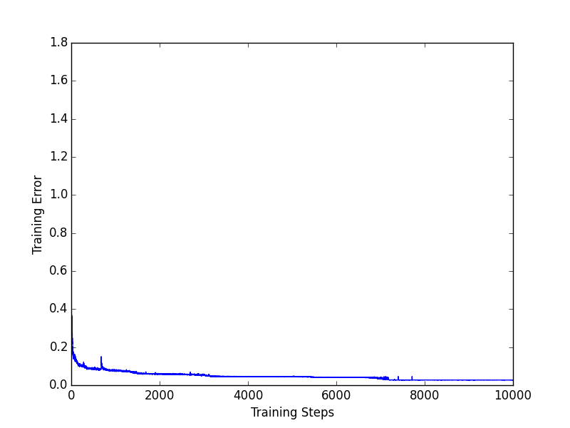
It may be indicated by the scale of the graph that the training errors varied quite a bit, 
however the network activation gave what we thought was a satisfying result.

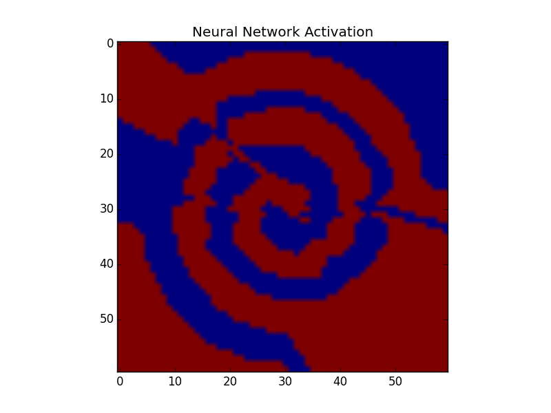

### Optimised ANN ###

After revisiting the documentation for pybrain we discovered the `buildNetwork`
method which is a tool used to help build FFN's without too much effort. 

This is illustrated by rerunning the network using the new approach with the same
parameters from our initial attempt:


Let it be noted that the training errors actually reached a lower value than in 
our optimised version below, however the resulting neural network activation was 
not as visually pleasing.

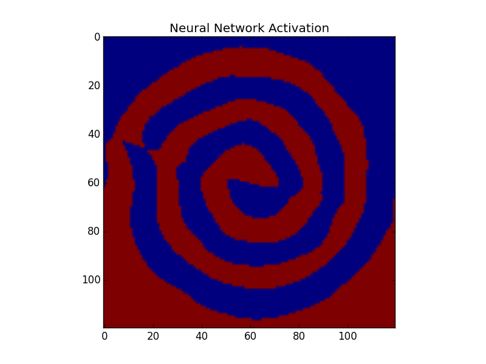

Below are our new optimised parameters:

```python
HIDDEN_LAYERS = [ 35, 35 ]
LEARNING_DECAY = 1 # Set in range [0.9, 1]
LEARNING_RATE = 0.096 # Set in range [0, 1]
MOMENTUM = 0.1 # Set in range [0, 0.5]
TRAINING_ITERATIONS = 1500
BATCH_LEARNING = False
VALIDATION_PROPORTION = 0.0
```

It may become evident that the required iterations are much lower than our initial
attempt, however the results are surprisingly much better.

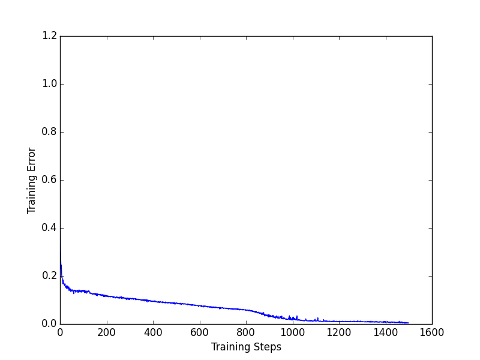
As mentioned in the initial attempt you can gather some information about the 
success of the training by looking at the scale of the graph. It is clear that 
this attempt faired much better just by changing the method in which we used to
built the network. Whereas there were spikes in our initial attempt, this 
optimised version faired much better without any real visible spiking.

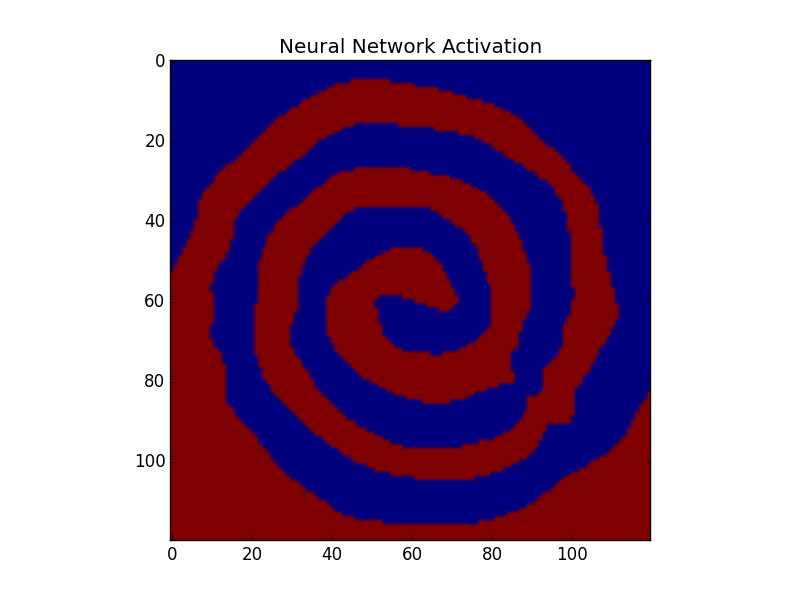

## Task b) ##

### Two-Spiral variant ##
Matlab code from the the following website was used for this part of the task to 
generate some different variants of "two-spiral" data:
[Matlab Datasets](http://au.mathworks.com/matlabcentral/fileexchange/41459-6-functions-for-generating-artificial-datasets)

This site contained a number of different datasets which could be used to train 
neural networks and SVMs. One of these datasets was a variant of the two-spiral 
dataset with the second spiral being slightly out of phase with the first.  We 
initially ran the data through the ANN with the same parameters from Task a). As 
can be seen below, the neural network activation for this training in no way resembled 
the initial data.

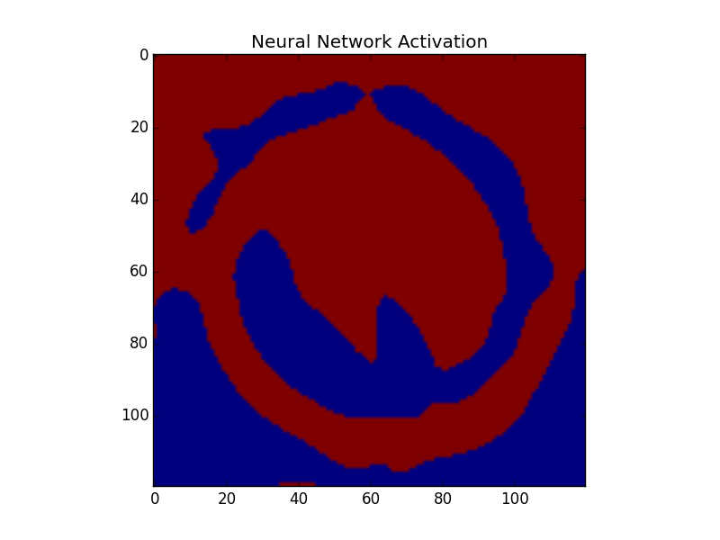

Further changes were required to various parameters including additional nodes in the hidden layers
and altering the number of training iterations.

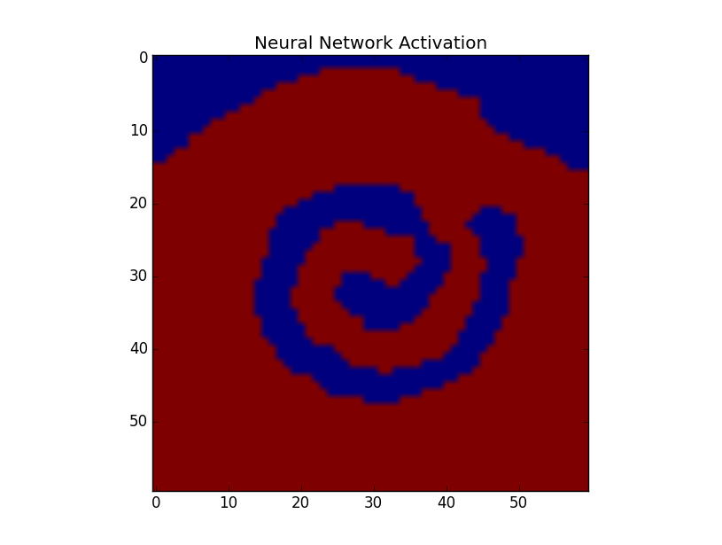
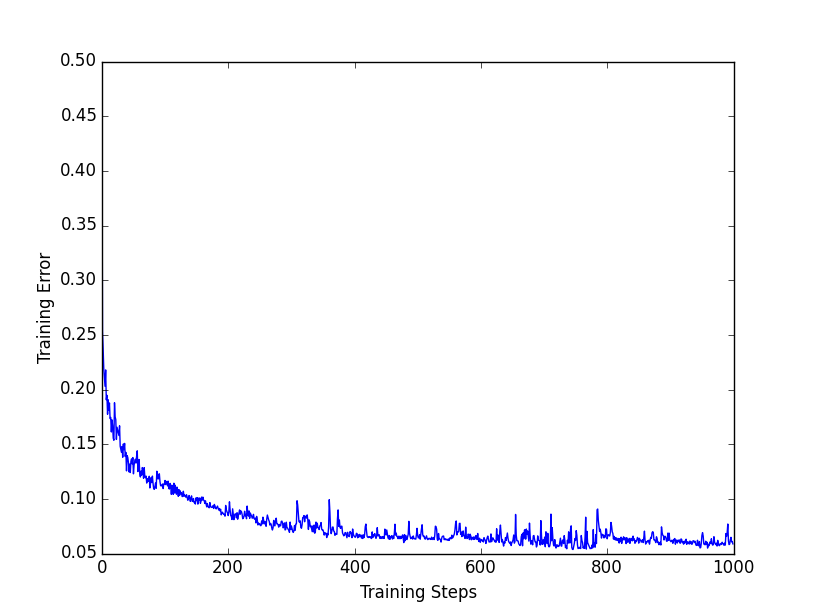

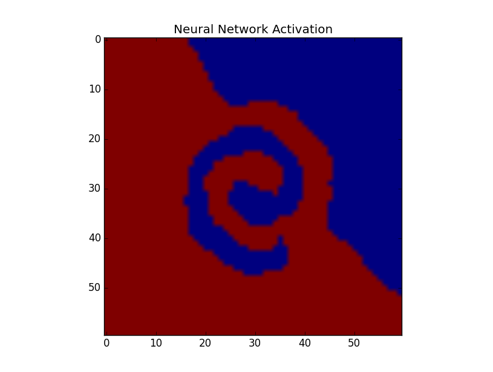
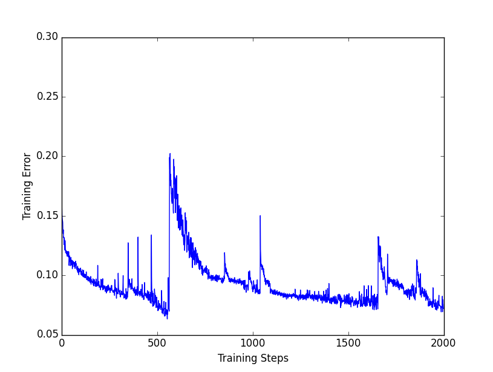

Following numerous successive training regimes, the final parameters were found to be below.

```python
HIDDEN_LAYERS = [55, 55, 55]
LEARNING_DECAY = 0.999999
LEARNING_RATE = 0.1
MOMENTUM = 0
TRAINING_ITERATIONS = 15000
BATCH_LEARNING = False
VALIDATION_PROPORTION = 0.0
```

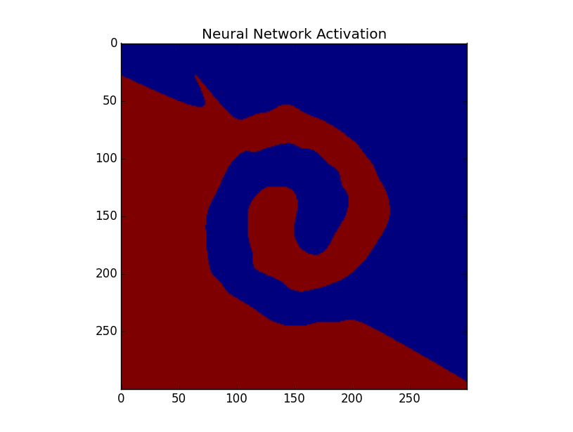
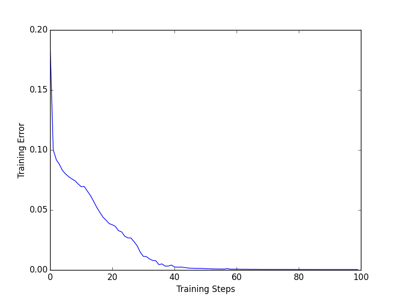

The comparison with applying our SVM architecture to this new dataset was dramatic. The SVM trained in a
fraction of a second with our previous parameters on the data and was able to almost perfectly graph the output
as shown below.

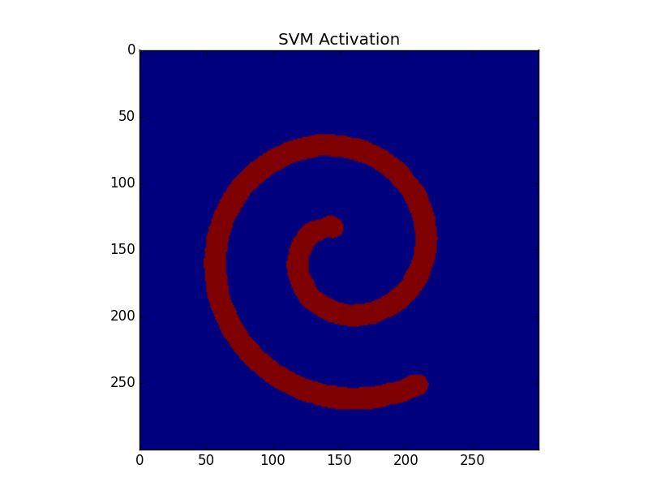

In this image we can easily see the different shapes of the two spirals in the variant data.

## Task c) ##

We found that the 4 spiral task took more iterations than 2 spirals to get a 
result that was at all meaningful in addition to an extra hidden layer, and more
neurons per layer.

```python
HIDDEN_LAYERS = [55, 55, 55]
LEARNING_DECAY = 0.999999
LEARNING_RATE = 0.1
MOMENTUM = 0
TRAINING_ITERATIONS = 15000
BATCH_LEARNING = False
VALIDATION_PROPORTION = 0.0
```

It is interesting to note that our best result was achieved with a momentum of 
zero. However, the result is not very desirable. 

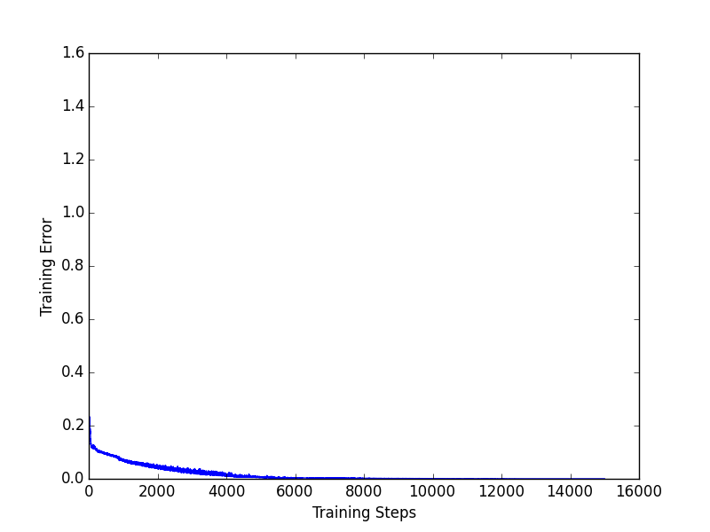
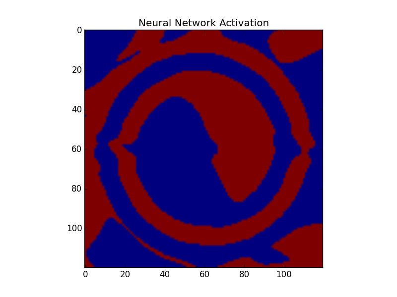

## Task d) ##

Comparing the implementation of Task A (training an artificial neural network on the two spirals task), the SVM responded extremely well to its initial values for its COST and GAMMA parameters to achieve a satisfying result as shown below:

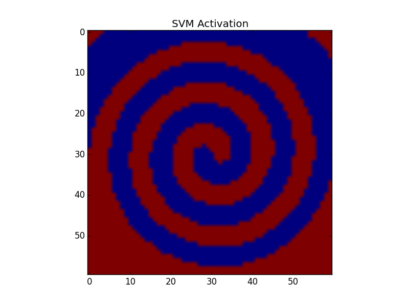
SVM Activation with Cost = 0.6, Gamma = 3.5

Modifying COST and GAMMA to 0.9 and 6 respectively (i.e. by increasing the cost of an incorrect classification, but providing less generality) we obtain the following result:

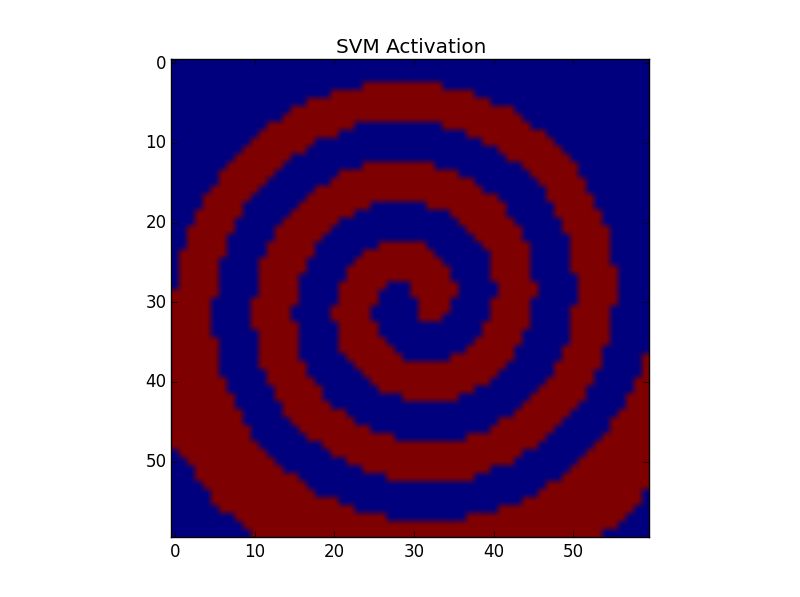
SVM Activation with Cost = 0.9, Gamma = 6

Furthermore, the time required to successfully train the SVM was significantly lower that that required to train the ANN (as expected)

|Iteration|SVM Training Time|
|---------|-----------------|
|1|0.00400018692017|
|2|0.00399994850159|
|3|0.00300002098083|
|4|0.00399994850159|
|5|0.00399994850159|
|6|0.00300002098083|
|7|0.00299978256226|
|8|0.00399994850159|
|9|0.00300002098083|
|10|0.00399994850159|
|Average|0.003599977493287|

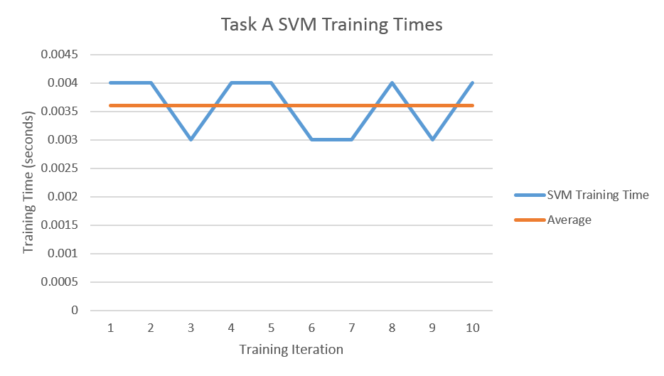
Task A SVM Training Times
