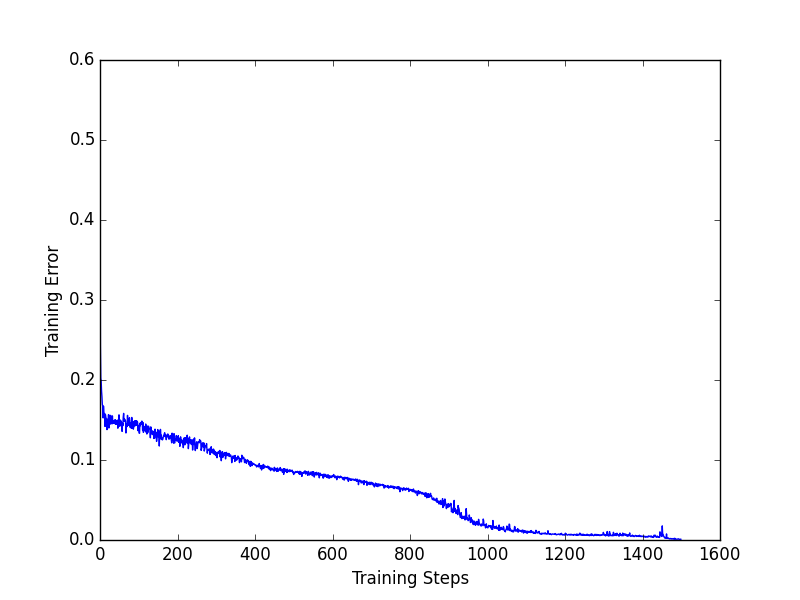

COMP3330 - Machine Intelligence
===============================

* Beau Gibson -
* Tyler Haigh - C3182929
* Simon Hartcher - C3185790
* Robert Logan -

# Question 1 - Variations of the Two-Spiral Task #

## Task a) ##

### Initial Attempt ###

Our initial attempt at training a FFN for the original dataset was with the following 
parameters:

```python
HIDDEN_LAYERS = [ 33, 33 ]
LEARNING_DECAY = 0.999999 # Set in range [0.9, 1]
LEARNING_RATE = 0.1 # Set in range [0, 1]
MOMENTUM = 0.1086 # Set in range [0, 0.5]
TRAINING_ITERATIONS = 10000
BATCH_LEARNING = False
VALIDATION_PROPORTION = 0.0
```

Using pybrain the initial implementation was using a manual instance of the 
`FeedForwardNetwork` class, adding the layers and making the connections ourselves.
The following graph and neural network activation show the results.


It may be indicated by the scale of the graph that the training errors varied quite a bit, 
however the network activation gave what we thought was a satisfying result.


### Optimised ANN ###

After revisiting the documentation for pybrain we discovered the `buildNetwork`
method which is a tool used to help build FFN's without too much effort. 

This is illustrated by rerunning the network using the new approach with the same
parameters from our initial attempt:


Let it be noted that the training errors actually reached a lower value than in 
our optimised version below, however the resulting neural network activation was 
not as visually pleasing.


Below are our new optimised parameters:

```python
HIDDEN_LAYERS = [ 35, 35 ]
LEARNING_DECAY = 1 # Set in range [0.9, 1]
LEARNING_RATE = 0.096 # Set in range [0, 1]
MOMENTUM = 0.1 # Set in range [0, 0.5]
TRAINING_ITERATIONS = 1500
BATCH_LEARNING = False
VALIDATION_PROPORTION = 0.0
```

It may become evident that the required iterations are much lower than our initial
attempt, however the results are surprisingly much better.


As mentioned in the initial attempt you can gather some information about the 
success of the training by looking at the scale of the graph. It is clear that 
this attempt faired much better just by changing the method in which we used to
built the network. Whereas there were spikes in our initial attempt, this 
optimised version faired much better without any real visible spiking.


## Task d) ##

Comparing the implementation of Task A (training an artificial neural network on the two spirals task), the SVM responded extremely well to its initial values for its COST and GAMMA parameters to achieve a satisfying result as shown below:


SVM Activation with Cost = 0.6, Gamma = 3.5

Modifying COST and GAMMA to 0.9 and 6 respectively (i.e. by increasing the cost of an incorrect classification, but providing less generality) we obtain the following result:


SVM Activation with Cost = 0.9, Gamma = 6

Furthermore, the time required to successfully train the SVM was significantly lower that that required to train the ANN (as expected) ``TODO: Add ANN Training Times``

|Iteration|SVM Training Time|ANN Training Time|
|---------|-----------------|-----------------|
|1|0.00400018692017|?|
|2|0.00399994850159|?|
|3|0.00300002098083|?|
|4|0.00399994850159|?|
|5|0.00399994850159|?|
|6|0.00300002098083|?|
|7|0.00299978256226|?|
|8|0.00399994850159|?|
|9|0.00300002098083|?|
|10|0.00399994850159|?|
|Average|0.003599977493287|?|


Task A SVM Training Times

# Question 2 - Autoencoder #

## Part 1 ##

**Determine experimentally what is the minimal number of hidden units required for training a 16-H-16 network successfully**

According to Tom Mitchell (1997), when backpropagation is applied to the autoencoder training task, the values of the hidden layers become similar to a binary encoding based on the number of hidden units. For an 8 input autoencoder, the network assigns values that when rounded, form the binary encodings 000 to 111 (i.e. 0 to 7). From here, it can be inferred that, in general, successfully training a neural network requires a single layer of lg(2) hidden units. Hence for the task of training a 16-H-16 network, we should only require 4 hidden units on a singple sigmoid layer, to perform this task. ``TODO: Prove this in out experiments``

