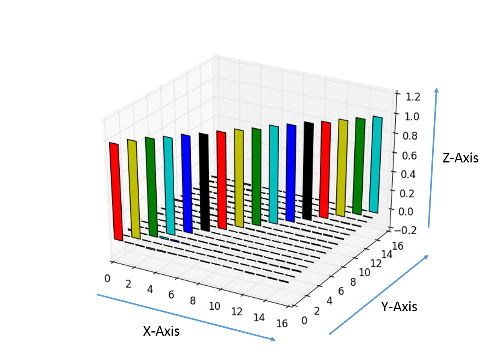

COMP3330 - Machine Intelligence
===============================

* Beau Gibson - C3146845
* Tyler Haigh - C3182929
* Simon Hartcher - C3185790
* Robert Logan - C3165020

# Question 2 - Autoencoder #

# How to Interpret the Graphs #

The graphs used throughout this report have been generated using [matplotlib's pyplot](http://matplotlib.org/api/pyplot_api.html) tool.



The x-axis indicates the index of the input vector (for this report, a 16 input vector). The y-axis indicates the input vector that has been activated upon. The z-axis indicates the activation levels for the particular index of the input vector.

## Part 1 ##

**Determine experimentally what is the minimal number of hidden units required for training a 16-H-16 network successfully**

For the initial experiment, we examined the behaviour of the network when given 16 Hidden Nodes on a single Sigmoid layer. As expected, the training error per training epoch decreased rapidly, and in the first 100 training iterations, resulted in the following activations:


Auto Encoder Base Line Activations (100)

In the interest of avoiding overfitting the network to the dataset (considering that the only inputs this network will ever expect are the inputs it is trained on), we reduced the number of training iterations considerably, from 100 to 10, producing the following result


Auto Encoder Base Line Activations (10)

From here, we began by finding an optimal adjustment of the learning rate, learning decay, and momentum, which would give the smallest possible training error towards the end of training the network. Once we were satisfied with the results, we reduced the number of hidden nodes in the sigmoid layer and repeated the process. As the reduced the number of hidden nodes, the final training error toward the end of training began to increase (as expected), and the process of slightly modifying the parameters became less effective.


Auto Encoder 8 Hidden Nodes with manual FeedForward Network (Errors)


Auto Encoder 8 Hidden Nodes with manual FeedForward Network (Activations)

```
HIDDEN_LAYERS = 8
LEARNING_DECAY = 0.9999
LEARNING_RATE = 0.359
MOMENTUM = 0.11649
TRAINING_ITERATIONS = 5000
BATCH_LEARNING = False
VALIDATION_PROPORTION = 0.0

```

Upon retesting using pybrain's built in shortcut ``buildNetwork(inDimension, hiddenNodes, outDimension)``, the we were able to achieve a better result with some further tweaking of parameters.


Auto Encoder 10 Hidden Nodes using ``buildNetwork()`` (Errors)


Auto Encoder 10 Hidden Nodes using ``buildNetwork()`` (Activations)

```
HIDDEN_LAYERS = 10
LEARNING_DECAY = 0.999501
LEARNING_RATE = 0.324501
MOMENTUM = 0.101
TRAINING_ITERATIONS = 1000
BATCH_LEARNING = False
VALIDATION_PROPORTION = 0.0
```


Auto Encoder 8 Hidden Nodes using ``buildNetwork()`` (Errors)


Auto Encoder 8 Hidden Nodes using ``buildNetwork()`` (Activations)

```
HIDDEN_LAYERS = 8
LEARNING_DECAY = 0.999501
LEARNING_RATE = 0.324501
MOMENTUM = 0.101
TRAINING_ITERATIONS = 1000
BATCH_LEARNING = False
VALIDATION_PROPORTION = 0.0
```

With the increase in misclassifiations and training error, it became too difficult to create an auto encoder that was able to correctly replicate the inputs using less than 8 hidden nodes on a single sigmoid layer. Experiments were done using a tanh layer, however these did not produce as satisfying results.

Whilst we were not able to achieve better results with less than 8 hidden nodes, we believe that it should be possible for the network to successfully learn the sparse coding sample using 4 hidden nodes. This has been elaborated in Part 3.

## Part 2 ##

**Conduct experiments on 16-h1-h2-16 ANNs and determine the minimum numer of hidden nodes in the layer**

**How does it compare to the experiments for the 16-H-16 perceptron**

Initially, it took much longer than expected to successgully train a neural network using two hidden layers of size 16. After some experimenting with the parameters, we were eventually able to create the following network.


Auto Encoder 16-16 Hidden Nodes using ``buildNetwork()`` (Errors)


Auto Encoder 16-16 Hidden Nodes using ``buildNetwork()`` (Activations)

```
HIDDEN_LAYERS = [16, 16]
LEARNING_DECAY = 0.99999
LEARNING_RATE = 0.275
MOMENTUM = 0.111
TRAINING_ITERATIONS = 1000
BATCH_LEARNING = False
VALIDATION_PROPORTION = 0.0
```

From the errors, it appears that the learning curve is less steep than when training with a single hidden layer. After we changed our network's architecture from two sigmoid layers, to one sigmoid and one tanh layer, we noticed a marked improvement in the learning ability. With our best attempt from Part 1, using 8 hidden nodes, the parameters suddenly became a viable solution to the autoencoder task.


Sigmoid Tanh 8-8 Hidden Nodes (Errors)


Sigmoid Tanh 8-8 Hidden Nodes (Activations)

```
HIDDEN_LAYERS = 8
LEARNING_DECAY = 0.9999
LEARNING_RATE = 0.07
MOMENTUM = 0.0
TRAINING_ITERATIONS = 1000
BATCH_LEARNING = False
VALIDATION_PROPORTION = 0.0
```

Even with this marked improvement in learning ability, we were still not able to achieve a satisfying result when attempting to use a layer of 4 hidden nodes. The following image is one of our better results


Sigmoid Tanh 4-4 Hidden Nodes (Activations)

```
HIDDEN_LAYERS = 4
LEARNING_DECAY = 0.9999
LEARNING_RATE = 0.211
MOMENTUM = 0.0
TRAINING_ITERATIONS = 1000
BATCH_LEARNING = False
VALIDATION_PROPORTION = 0.0
```

From our research into Deep Learning, we hypothesise that the minimum number of hidden nodes to successfully train this network will still be four. The reason for this is the mirroring of the network compression and decompression at its various levels. With only two hidden layers, the minimal compression available will be to reproduce the binary encoding for the input vector.

## Part 3 ##

**Discuss the role of hidden layers and the role of this type of network**

According to Tom Mitchell (1997), when backpropagation is applied to the autoencoder training task, the values of weights from the inputs to the hidden layer nodes become close to a binary encoding based on the number of hidden units (note that the binary encodings may not be in exact numberic order). For an 8 input autoencoder, the network assigns values that when rounded, form the binary encodings 000 to 111 (i.e. 0 to 7).

From this, the role of the hidden layer when using a X-H-X perceptron is to provide the compression of information  using the binary encoding of lg(X) for the weights on the inputs to extract the important features from the data. Hence for the task of training a 16-H-16 network, we should have only required 4 hidden units on a single sigmoid layer, to perform the task.

This type of network can be used for the following types of training tasks:

### Undercompletion Tasks ###
The network compresses the information provided from the inputs to simplify the data when learning, with the restriction that it will only compress well for the data it has observed in training set. When given an input that was not in the original dataset, it may not be able to reconstruct the information. Undercompletion tasks can be found in Deep Learning where the input vector is compressed througout half of the network, in order to extract unique features. Refer to Deep Learning for more details.

## Overcompletion Tasks ##
The network contains at least as many hidden nodes as the inputs which may permit the network to simply copy the inputs through thetwork, hence not learning any useful features from the data.

The denoising autoencoder aims to represent the information using an overcomplete network and be robust to noise in the input data. The network is hence forced to learn the structure and meaningful features from the data in order to reconstruct the input from its corrupted form.

This can be applied the the MNIST handwriting classifier task where a new (noisy) input can be classified to its correct class. [Larochelle, et. al.](https://www.iro.umontreal.ca/~vincentp/Publications/denoising_autoencoders_tr1316.pdf) applied this form of learning in 2008, adding various levels of noise to the MNIST input data. They found that with more noise, more features could be learned from the data. Such features appeared to be indicative of pen stroke detectors.


MNIST Filtered Data 50% Corruption ([Larochelle et. al.](https://www.iro.umontreal.ca/~vincentp/Publications/denoising_autoencoders_tr1316.pdf)) ([Larochelle et. al. (10:17)](https://www.youtube.com/watch?v=t2NQ_c5BFOc&t=10m17s))

## Deep Learning ##

Deep Learning attempts to model high-level abstractions in data using a multi-layer representation of a network. Such examples include a multi-layer feed-forward artifial neural network, and a Boltzmann machine ([Larochelle, 2013](https://www.youtube.com/watch?v=vXMpKYRhpmI)). Each layer in the representation maps to a vector which extracts a unique feature from the input. Due to the fact that the units which establish these features are not mutually exclusive, two units in the network can be active at the same time.

When deep learning is applied to an autoencoder, the network gradually reduces the vector representations of the information at each layer until it reaches the middle point where it has compressed the data, and obtained the most unique features, as much as it can, and then proceedes to reproduce the information in a series of hidden "output" units which create a mirror of the network architecture, finally reproducing the original information (e.g. a picture of someone's face) ([Hinton, Salakhutdinov, 2006](https://www.youtube.com/watch?v=z5ZYm_wJ37c&t=1m29s))

# References #

https://www.iro.umontreal.ca/~vincentp/Publications/denoising_autoencoders_tr1316.pdf - *Extracting and Composing Robust Featurs with Denoising Autoencoders* (Vincent, Larochelle, Benigo, Manzagol)

*Machine Learning* - Tom Mitchell ISBN 0070428077

https://www.youtube.com/watch?v=vXMpKYRhpmI - *Neural Networks [7.1] : Deep learning - motivation* (Hugo Larochelle, YouTube)

https://www.youtube.com/watch?v=5rLgoM2Pkso - *Neural networks [6.5] : Autoencoder - undercomplete vs. overcomplete hidden layer* (Hugo Larochelle, YouTube)

# Appendix - SVM Training #

As an extra task, we attempted to use an SVM to solve the autoencoder task of classifying the correct class of input. As expected, the SVM was able to correctly classify the inputs as seen below.


SVM Training for Autoencoder (x-axis = Input Vector, y-axis = Classification Class)