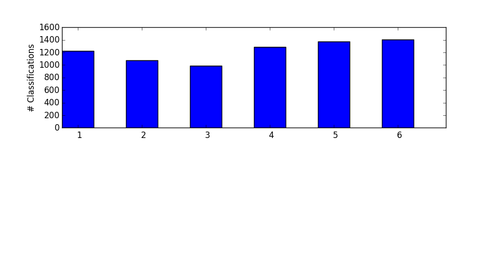

COMP3330 - Machine Intelligence
===============================

* Beau Gibson - C3146845
* Tyler Haigh - C3182929
* Simon Hartcher - C3185790
* Robert Logan - C3165020

# Question 3 - Classifier #

**Classification for Human Activity Recognition**

For this task we chose to train an SVM based on the successful architectures and results from previous questions.
These have proven to be both fast and accurate for continued use. The task here was to create a function which would
successfully analyse records consisting of 561 attributes and correctly classify them into one of the six following human movements:

1. Walking
2. Walking Upstairs
3. Walking Downstairs
4. Sitting
5. Standing
6. Laying

Approaching the task we used as a basis the "trainsvm" code from the labs. This SVM was used successfully to classify the handwriting
recognition data, which is similar to this task. We applied the following parameters:

```python
Cost = 0.9
Gamma = 6
Kernel = RBF
```

The graph below indicates that the SVM used for the task was able to classify all activities successfully with 100% accuracy.



The training was also performed relatively quickly as was found also with the other implementations of the SVM to
the problems. This particular function could easily be used within a smartphone environment being efficient in both
time and space considerations.

